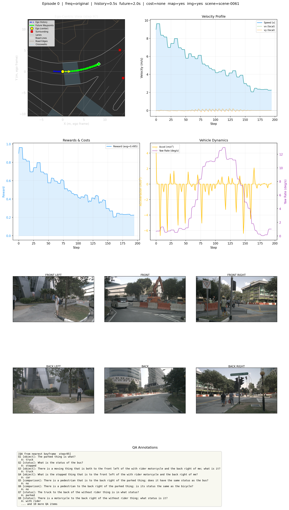

# MetaQA

**MetaQA** integrates [MetaDrive](https://github.com/metadriverse/metadrive)/[ScenarioNet](https://github.com/metadriverse/scenarionet) converted data with [NuScenes-QA](https://github.com/qiantianwen/NuScenes-QA) question-answering annotations for multi-modal autonomous driving research.

---

## Architecture

```
NuScenes (~12Hz)           ScenarioNet (10Hz)         NuScenes-QA (2Hz)
  ┌──────────┐             ┌────────────────┐           ┌──────────┐
  │ samples/ │             │ .pkl scenario  │           │ QA JSON  │
  │ sweeps/  │             │ trajectories   │           │ per      │
  │ camera   │             │ (ego + traffic)│           │ sample   │
  └────┬─────┘             └──────┬─────────┘           └────┬─────┘
       │                          │                          │
       ▼                          ▼                          ▼
  NuScenesOriginal         TrajectoryInter-          NuScenesQA-Loader
  Processor                polator (~12Hz)                   │
       │                          │                          │
       └───────────────┬──────────┘                          │
                       ▼                                     │
                    ReplayOriginalEnv  ◄─────────────────────┘
                     (synchronized)
                            │
                            │
                            ▼
        collect_data (collect offline RL data) 
        replay_demo & scenario_demo
```

**Data Flow:**
- **NuScenes Original Processor**: Extracts all frames (samples + sweeps) at ~12Hz with timestamps
- **Trajectory Interpolator**: Interpolates ScenarioNet 10Hz trajectories to match ~12Hz timestamps
- **QA Loader**: Maps NuScenes-QA annotations to sample tokens
- **ReplayOriginalEnv**: Synchronizes all three data sources for frame-by-frame replay
- **collect_data.py**: Collects offline RL datasets (observations, actions, rewards, costs, QA)
- **replay_demo.py**: Generates GIFs with MetaDrive BEV + 6-camera grid + QA panel
- **scenario_demo.py**: Real-time visualization with trajectory + surrounding vehicles

---

## Demo

<p align="center">
  
</p>

*Integrated visualization showing MetaDrive BEV, 6-camera grid, and QA annotations*

---

## Installation

```bash
# Same as scenarionet (https://github.com/metadriverse/scenarionet)
```

---

## Data Preparation

Place your data in the `dataset/` directory:

```
dataset/
├── QA_Data/
│   ├── NuScenes_QA_train.json    # NuScenes-QA annotations (train split)
│   └── NuScenes_QA_val.json      # NuScenes-QA annotations (val split)
└── Scenario_Data/
    ├── exp_nuscenes/
    │   └── v1.0-mini/            # Original NuScenes dataset
    │       ├── samples/          # Keyframe images (2Hz)
    │       ├── sweeps/           # Inter-keyframe images (~12Hz)
    │       ├── v1.0-mini/        # Metadata JSONs
    │       └── ...
    └── exp_nuscenes_converted/   # ScenarioNet converted scenarios
        ├── exp_nuscenes_converted_0/
        ├── exp_nuscenes_converted_1/
        └── ...
```

---

## Project Structure

```
MetaQA/
├── meta_qa/
│   ├── core/                       # Core RL components
│   │   ├── config.py              # Configuration constants (PID gains, colors, etc.)
│   │   ├── env.py                 # TrajectoryEnv (trajectory action → control)
│   │   ├── action_space.py        # Trajectory action space definition
│   │   └── trajectory_tracker.py  # PID-based trajectory tracking controller
│   │
│   ├── cost/                       # Cost functions for Safe RL (CMDP)
│   │   ├── base.py                # Abstract base cost function
│   │   ├── collision.py           # Binary collision cost
│   │   ├── ttc.py                 # Time-to-Collision cost
│   │   └── kinematic.py           # Kinematic stability cost
│   │
│   ├── tools/                      # Data processing, visualization & utilities
│   │   ├── structures.py          # MDP/CMDP data classes
│   │   ├── qa_loader.py           # NuScenes-QA data loader & scene matcher
│   │   ├── nuscenes_original.py   # Original frequency (~12Hz) frame extraction
│   │   ├── interpolation.py       # Trajectory interpolation (10Hz → ~12Hz)
│   │   ├── replay_original.py     # Original frequency replay environment
│   │   ├── trajectory_vis.py      # Trajectory visualization (OpenCV/Matplotlib)
│   │   └── surrounding.py         # Surrounding vehicle extraction from MetaDrive
│   │
│   └── scripts/                    # Runnable scripts
│       ├── demo_vis/              # Visualization demos
│       │   ├── replay_demo.py     # GIF/console replay with BEV + cameras + QA
│       │   └── scenario_demo.py   # Trajectory + surrounding vehicle visualization
│       └── data_collect/          # Data collection
│           ├── collect_data.py    # Unified data collection (all modes)
│           └── read_data.py       # Dataset inspection & visualization
│
├── dataset/                        # Input data
└── outputs/                        # Output directory
    ├── offline_data/              # Collected datasets (.h5)
    └── vis/                       # Visualizations (.gif, .png)
```

---

## Scripts Usage

### 1. Replay Demo

Generate animated GIFs with synchronized MetaDrive BEV, 6-camera grid, and QA annotations.

```bash
# List available scenes with QA data
python -m meta_qa.scripts.demo_vis.replay_demo --list-scenes

# Generate GIF for a scene
python -m meta_qa.scripts.demo_vis.replay_demo --scene scene-0061 --output outputs/vis/demo.gif

# Console demo (text output)
python -m meta_qa.scripts.demo_vis.replay_demo --scene scene-0061 --mode console

# Samples only (keyframes at 2Hz)
python -m meta_qa.scripts.demo_vis.replay_demo --scene scene-0061 --samples-only \
    --fps 2 --output outputs/vis/demo.gif

# Custom FPS, resolution, and frame limit
python -m meta_qa.scripts.demo_vis.replay_demo \
    --scene scene-0061 --width 1600 --height 1000 --fps 5 --max-frames 50
```

**Arguments:**
| Argument | Default | Description |
|----------|---------|-------------|
| `--mode` | gif | Mode: `gif` / `console` / `list` |
| `--scene` | None | Scene name (e.g., `scene-0061`) |
| `--list-scenes` | — | List available scenes and exit |
| `--output` | auto | Output GIF path |
| `--width` | 1200 | GIF width in pixels |
| `--height` | 900 | GIF height in pixels |
| `--fps` | 12 | Frame rate |
| `--samples-only` | False | Show only 2Hz keyframes |
| `--max-frames` | None | Max frames to process |

---

### 2. Scenario Demo

Visualize ego trajectory with surrounding vehicles, control signals, and statistics.

```bash
# Top-down view (default)
python -m meta_qa.scripts.demo_vis.scenario_demo

# 3D view
python -m meta_qa.scripts.demo_vis.scenario_demo --mode 3d

# Custom trajectory horizon and detection radius
python -m meta_qa.scripts.demo_vis.scenario_demo --horizon 3.0 --detection-radius 40
```

**Arguments:**
| Argument | Default | Description |
|----------|---------|-------------|
| `--mode` | topdown | View mode: `topdown` / `3d` / `stats` |
| `--horizon` | 2.0 | Trajectory horizon in seconds |
| `--detection-radius` | 50.0 | Surrounding vehicle detection radius (m) |
| `--max-vehicles` | 10 | Max surrounding vehicles to track |
| `--save-gif` | True | Save visualization as GIF |
| `--plot-stats` | True | Plot statistics after completion |
| `--scenario-index` | random | Specific scenario index |

---

### 3. Collect Data

Trajectory-based offline RL data collection. All observations use historical trajectory, and all actions are future waypoint trajectories.

```bash
# Original frequency (~12Hz) - includes QA + map by default
python -m meta_qa.scripts.data_collect.collect_data

# Disable QA annotations
python -m meta_qa.scripts.data_collect.collect_data --qa false

# Disable map features
python -m meta_qa.scripts.data_collect.collect_data --map false

# Keyframe only (2Hz) - still includes QA + map
python -m meta_qa.scripts.data_collect.collect_data --frequency keyframe

# Custom trajectory windows
python -m meta_qa.scripts.data_collect.collect_data \
    --history_sec 1.0 --future_sec 3.0

# CMDP with TTC cost
python -m meta_qa.scripts.data_collect.collect_data --cost_type ttc

# Specific scenes with all features
python -m meta_qa.scripts.data_collect.collect_data \
    --scenes scene-0061 scene-0103
```

**Parameters:**
| Argument | Default | Description |
|----------|---------|-------------|
| `--frequency` | original | Data frequency: `original` (~12Hz) / `keyframe` (2Hz) |
| `--qa` | true | Include QA annotations (use `--qa false` to disable) |
| `--map` | true | Include map features (use `--map false` to disable) |
| `--map_radius` | 50.0 | Radius (m) around ego trajectory to collect map features |
| `--history_sec` | 0.5 | Historical observation window in seconds |
| `--future_sec` | 2.0 | Future trajectory horizon in seconds |
| `--cost_type` | none | Cost type: `none` / `collision` / `ttc` |
| `--output` | auto | Output HDF5 file path |
| `--scenes` | all | Specific scene names |

**Observation Format:**
- Ego trajectory: `history_steps × (x, y, vx, vy, heading)` in local frame
- Surrounding vehicles: `history_steps × max_vehicles × (rel_x, rel_y, rel_vx, rel_vy, heading)`

**Action Format:**
- Future waypoints: `future_steps × (rel_x, rel_y, rel_vx, rel_vy, heading)` in local frame

**Output Format (HDF5):**
- `observations`: (N, obs_dim) — Trajectory-based observations
- `actions`: (N, action_dim) — Future waypoint actions
- `rewards`: (N,) — MetaDrive ScenarioEnv rewards (driving progress, penalties, terminal bonuses)
- `terminals`: (N,) — Episode termination flags
- `costs`: (N,) — Safety costs (CMDP only, when `--cost_type` is set)
- `qa_data`: QA annotations (when `--qa` is set)
- `map_data`: Per-episode map features (when `--map` is set)
- `frame_metadata`: Per-step metadata:
  - `timestamps`, `is_sample`, `sample_indices`, `interpolation_ratios`
  - `ego_world_x`, `ego_world_y`, `ego_world_heading` — global pose
  - `scene_names` — scene name per step
  - `image_CAM_*` — 6 camera image relative paths per step
- `metadata` (attrs): Collection parameters (frequency, history/future steps, dimensions, etc.)


---

### 4. Read/Inspect Data

Inspect and visualize collected offline RL datasets.

```bash
# Show dataset info and statistics
python -m meta_qa.scripts.data_collect.read_data \
    --file outputs/offline_data/original_qa_map.h5

# List available datasets in output directory
python -m meta_qa.scripts.data_collect.read_data --list

# Show sample data points (observations, actions, rewards, costs)
python -m meta_qa.scripts.data_collect.read_data \
    --file outputs/offline_data/original_qa_map.h5 --samples 5

# Show QA annotations
python -m meta_qa.scripts.data_collect.read_data \
    --file outputs/offline_data/original_qa_map.h5 --show_qa --max_qa 10

# Visualize episode trajectory (ego-centric view)
python -m meta_qa.scripts.data_collect.read_data \
    --file outputs/offline_data/original_qa_map.h5 --visualize --episode 5

# Save visualization to file
python -m meta_qa.scripts.data_collect.read_data \
    --file outputs/offline_data/original_qa_map.h5 --visualize --episode 5 \
    --save_fig outputs/vis/episode_5.png

# Visualize data distributions
python -m meta_qa.scripts.data_collect.read_data \
    --file outputs/offline_data/original_qa_map.h5 --visualize_dist \
    --save_fig outputs/vis/distribution.png

# Skip info printing (useful when only visualizing)
python -m meta_qa.scripts.data_collect.read_data \
    --file outputs/offline_data/original_qa_map.h5 --visualize --no_info
```

**Visualization Features:**

**Episode Trajectory View** (`--visualize`):
- **Row 1-2: Core Metrics** (4 charts in 2×2 layout)
  - **Ego-Centric Snapshot**: Single timestep view centered on ego vehicle
    - Map features (when collected with `--map`): lanes, road lines, crosswalks, road edges
    - Blue dashed: historical trajectory (ego history)
    - Green solid: future waypoints (planned trajectory)
    - Yellow circle: current ego position with heading arrow
    - Red squares: surrounding vehicles with history trails
    - Dark background with map context for better visualization
    - Axis limits automatically adjusted to focus on ego trajectory
  - **Velocity Profile**: speed, vx, vy over time
  - **Rewards & Costs**: dual-axis plot with cost event markers
  - **Vehicle Dynamics**: acceleration (m/s²) and yaw rate (deg/s) over time
- **Row 3: Surround Camera Images** (2×3 grid, when available)
  - 6-camera view: FRONT_LEFT, FRONT, FRONT_RIGHT (top row)
  - BACK_LEFT, BACK, BACK_RIGHT (bottom row)
  - Images synchronized to the snapshot timestep
- **Row 4: QA Annotations** (when available)
  - Question-answer pairs from the nearest keyframe
  - Displays up to 8 QA items with template types

**Data Distribution View** (`--visualize_dist`):
- **Ego Speed Distribution**: histogram of ego speeds across dataset
- **Future Waypoints Scatter**: 2D scatter of planned trajectories (500 samples)
- **Ego History Positions**: xy scatter colored by time step
- **Heading Change Distribution**: future heading angle changes

**Arguments:**
| Argument | Description |
|----------|-------------|
| `--file` / `-f` | Path to HDF5 dataset file |
| `--list` / `-l` | List all available datasets |
| `--samples` / `-s` | Number of sample data points to print (default: 3) |
| `--start` | Starting index for sample printing (default: 0) |
| `--show_qa` | Display QA annotations |
| `--max_qa` | Maximum QA items to show (default: 20) |
| `--visualize` / `-v` | Visualize episode trajectory |
| `--visualize_dist` | Visualize observation/action distributions |
| `--episode` / `-e` | Episode index to visualize (default: 0) |
| `--save_fig` | Save visualization to file (PNG/PDF) |
| `--no_info` | Skip dataset info printing |


---

## Data Visualization

The dataset visualization provides comprehensive insights into collected offline RL data:

<p align="center">
  
</p>

*Multi-row visualization showing:*
- *Row 1-2: Ego-centric trajectory, velocity profile, rewards/costs, vehicle dynamics*
- *Row 3: Synchronized 6-camera surround view*
- *Row 4: QA annotations from nearest keyframe*

---

## Acknowledgments

This project builds upon the excellent work of:

- [MetaDrive](https://github.com/metadriverse/metadrive)
- [ScenarioNet](https://github.com/metadriverse/scenarionet)
- [NuScenes-QA](https://github.com/qiantianwen/NuScenes-QA)
- [ASAP](https://github.com/JeffWang987/ASAP)

---

## License

This project is licensed under the MIT License - see the [LICENSE](LICENSE) file for details.
